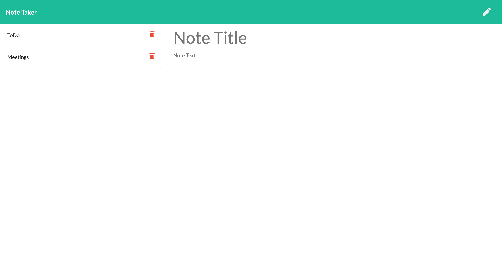

# Note Taker

  ## Description

  A note simple note taking app that allows you to easily save your reminders on the go.
  [Click to launch! 🚀](https://luna-note-taker.herokuapp.com/)

  ## Table of Contents

  * [Image](#image)
  * [Technologies](#technologies)
  * [Known-Bugs](#known-bugs)
  * [Next-Steps](#next-steps)
  * [License](#license)
  * [Contact](#contact)
  * [Links](#links)

  ## Image

  

  ## Technologies
  
  HTML, CSS, Javascript, Node (npm: moment, uuid, f)

  ## Known-Bugs

  No known bugs at this time.

  ## Next-Steps

  Add an update route to edit notes. Add functionality to display the date the note was entered.

  ## License

  This project is licensed under the [MIT](https://opensource.org/licenses/MIT) license.
  

  ## Contact

  Author: Ray Luna 

  If you have any questions about the repo, open an issue or contact me directly at:
  - E-Mail: leon.luna.ray@gmail.com
  - GitHub: [leon-luna-ray](https://github.com/leon-luna-ray)

  ## Links

  - [Deployed Project](https://luna-note-taker.herokuapp.com/) 

  - [Project Repository](https://github.com/leon-luna-ray/notes-app)

  